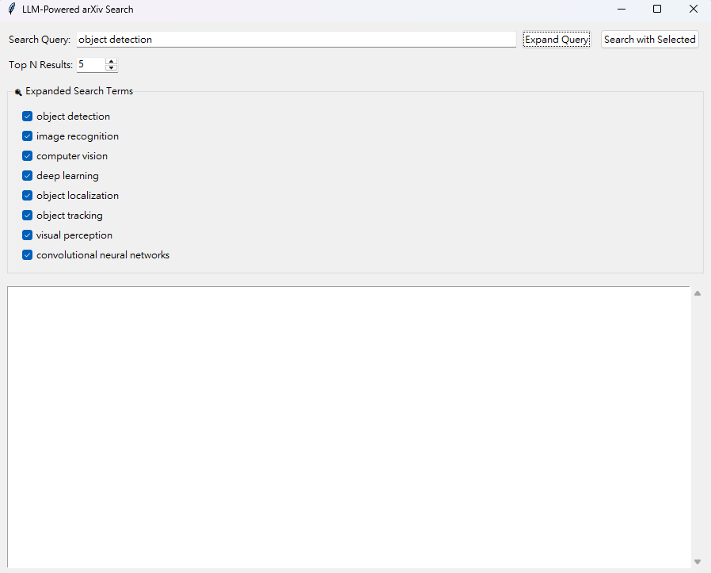
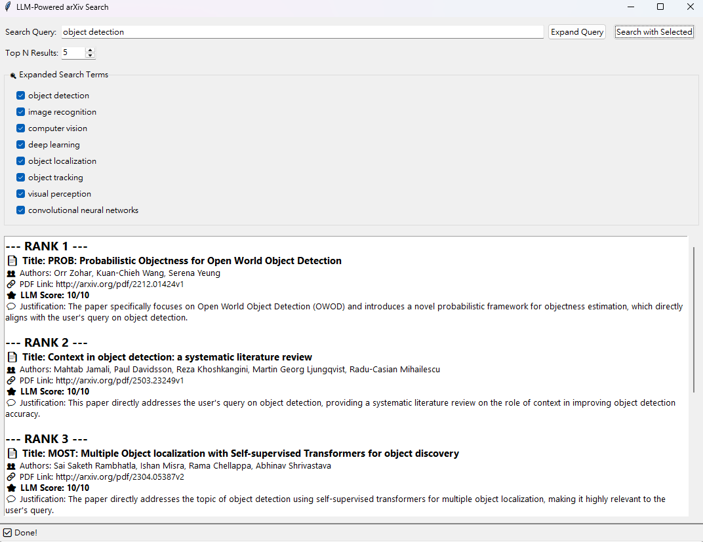

## LLM-Powered arXiv Search

A lightweight information-retrieval helper that combines online search (arXiv) with LLM-assisted query expansion and LLM-based re-ranking. Use the GUI to explore expanded search terms and view top-ranked papers, or the CLI for quick terminal-based searches.

### Features
- **LLM query expansion**: Generates 5–7 related keywords to broaden recall.
- **arXiv retrieval**: Fetches candidate papers per term via the `arxiv` API.
- **LLM re-ranking**: Scores papers for relevance and provides a brief justification.
- **GUI and CLI**: Tkinter desktop UI plus a simple command-line entrypoint.

### UI Preview
- Query expansion:



- Results view:



---

## Getting Started

### Environment setup

Conda :
```bash
conda env create -f environment.yml
conda activate llm_ir_search
```


### Configure API Key
Set your OpenAI API key in the environment before running:
```bash
# Windows PowerShell
$env:OPENAI_API_KEY = "sk-..."
# macOS/Linux
export OPENAI_API_KEY="sk-..."
```

---

## Usage

### Run the GUI (Tkinter)
```bash
python app_ui.py
```
- Enter your query, press "Expand Query" to see suggested terms.
- Select the terms you want, choose Top N, then click "Search with Selected".

### Run from the Command Line
```bash
python main_search.py "your initial query" --max_results_per_term 5 --top_n 5
```
Arguments:
- `query` (positional): Your initial search query
- `--max_results_per_term` (int, default 5): arXiv fetch count per expanded term
- `--top_n` (int, default 5): Number of final results to display

---

## How It Works
- `llm_handler.py`: Uses `langchain-openai` to call `gpt-3.5-turbo` for:
  - Query expansion → comma-separated keywords
  - Paper re-ranking → JSON with `relevance_score` and `justification`
- `online_search.py`: Queries arXiv and returns paper metadata (title, authors, summary, pdf_url).
- `app_ui.py`: Tkinter desktop UI that orchestrates expansion, search, and display.
- `main_search.py`: CLI flow that mirrors the UI logic.

### Project Structure
```text
LLM-powered_IR_search/
├─ app_ui.py          # Tkinter GUI for expansion + search + results
├─ main_search.py     # CLI entrypoint
├─ online_search.py   # arXiv retrieval helpers
├─ llm_handler.py     # LLM (LangChain + OpenAI) expansion + re-ranking
└─ README.md          # You are here
```

## Notes
- Models and API behavior may evolve; adjust the model name in `llm_handler.py` if needed.
- Consider adding retry/backoff if you encounter transient API errors.

--
